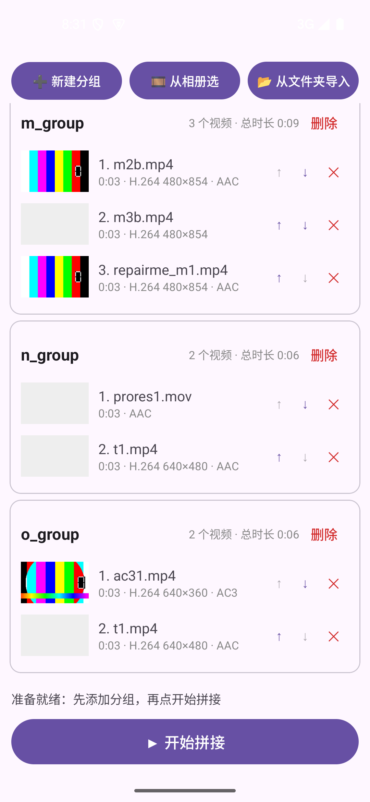

# 批量视频拼接器 (VideoStitcher)

一个只做一件事的安卓小工具：把多组视频分别首尾相连拼成一个 MP4，支持批量处理多个分组。
免费、无广告、不联网（未声明任何网络权限），所有处理都在手机本地完成。

A minimal Android app that stitches multiple groups of videos into one MP4 each — free, ad-free, and fully offline.

## 功能特性

- **批量分组**：多选视频自动成组，或「从文件夹导入」一个总目录、每个子文件夹自动成一组
- **三级引擎，能无损绝不转码**：
  1. **无损拼接**（秒级、零画质损失）——组内编码/分辨率/拍摄方向/音频参数一致且为 MP4/MOV/M4V，直接在容器层拼接（mp4parser）；帧率不同也能拼（输出可变帧率）；竖拍视频的方向元数据原样保留
  2. **无损转封装**（快、零画质损失）——参数一致（无旋转元数据）但容器为 MKV/WebM/TS 等时，直接拷贝流换壳成 MP4
  3. **自动转码拼接**（1.5 新增，较慢）——混合编码/分辨率/拍摄方向/音频的分组，用 ffmpeg 逐段独立软编成统一参数（H.264+AAC）再拼；旋转用 transpose 烤进像素，拼前做 SPS/PPS 字节级比对，拼后成品自检
- **成品自检**：拼完先核对时长、首/中/尾三点试解码、检查采样表，自检不过自动换更稳妥方式重拼，仍失败则中止——绝不把解不动的文件标成成功
- **编码格式显示**：每个视频下方直接显示 `H.265 1920×1080 · AAC`、`AV1 1072×1920 · Opus` 等
- **可停止拼接**：拼接期间主按钮变红为「停止拼接」，确认后立即停止；未完成的
  半成品自动清理，已完成的成品保留，可随时重新开始
- **拼接后可删源**：分组卡片上的「删除原视频」按钮在**该组拼接成功后**由灰变红，
  点击才删除（相册媒体走系统确认进回收站，Android 11+ 30 天内可恢复）；失败组保持灰色不可误删
- 拼接完成后可**一键删除源视频**（走系统删除确认，Android 11+ 进回收站可恢复）
- 自然排序（`01、02、…、10`）、拖动排序（↑↓ 正确交换不覆盖）、分组自动保存、成品输出到 `相册/Movies/VideoStitcher/`，完成后一键跳转系统相册

## 已知缺陷与限制

- **混合参数走转码，较慢**：不同编码/分辨率/方向/音频的分组会自动转码（H.264+AAC 统一参数），
  耗时约为视频时长本身，且是重编码（有损、体积增大）。能无损的组仍全程无损。
- **HDR 色调映射未做**：HDR 源混入转码时直接按 SDR 转换，色彩可能偏淡；
  纯 HDR 均匀组仍走无损不受影响。1.5 的已知限制。
- **32 位设备没有转码引擎**：内嵌 ffmpeg 仅含 arm64-v8a/x86_64（16KB 页对齐），
  armeabi-v7a 老设备保留两级无损功能，混合参数分组会中止提示。
- **无损转封装范围有限**：仅支持能直封 MP4 的编码。MP3/AC3/FLAC 音频、MPEG-2 视频等
  会中止提示；带旋转元数据的 MKV/WebM 也不支持转封装（竖拍视频请用 MP4/MOV 原件，
  容器层拼接可以原样保留方向）。
- **封装不规范且转码也救不了的文件会中止**：个别来源特殊的视频（网页下载/聊天转发）
  引擎读不动时中止提示。没有自动修复——1.2 的自动修复实测会产出更多坏文件，已移除。
- **WMV/ASF、RM/RMVB 容器无法导入**（安卓无对应解码组件）。
- **外来轨道自动剥离**：Android 13+ 录屏 MP4 的隐藏元数据轨、字幕/时间码轨会在拼前
  无损剥离（`-c copy` 秒级，不重编码）——不剥离的话所有引擎都读不了这类文件
- **拼接边界小瑕疵**：个别组在两段视频交界处存在 dts 时间戳重复（历史遗留问题），
  主流播放器无感，极严格的播放器或电视盒子上可能在交界点轻微卡顿。

## 未来优化空间

详细方案见 [ROADMAP.md](ROADMAP.md)，概要：

1. **v1.5 已落地路线 B**：ffmpeg 社区续维护版逐段独立软编，混合参数组自动转码；
   真机验收（混合编码/横竖混向/混合分辨率）进行中。
2. **APK 减重（计划）**：当前用社区 full-gpl 预编译包，后续自编译裁剪
   （只开需要的解码器/滤镜），预计可从 ~40MB native 库压到 ~15MB。
3. **HDR→SDR 色调映射**：转码路径接入 tonemap/zscale，解决 HDR 源直转偏淡。
4. **拼接边界 dts 重排**：用 ffmpeg concat -c copy 对边界时间戳做无损重排，修掉历史遗留瑕疵。
5. **路线 C 已关闭**：media3 最新 1.11.1（2026-09）仍未修复序列旋转缺陷，不再观望。

## 截图



## 下载安装

前往 [**Releases**](https://github.com/november-is-your-birthday/VideoStitcher/releases) 下载最新的 `批量视频拼接器.apk`，直接安装（允许未知来源即可）。

支持 Android 7.0（API 24）及以上。

## 构建方法

```bash
git clone https://github.com/november-is-your-birthday/VideoStitcher.git
cd VideoStitcher
./gradlew assembleDebug
# 产物：app/build/outputs/apk/debug/app-debug.apk
```

或用 Android Studio 打开项目直接运行。`local.properties` 不在仓库中，命令行构建时 Gradle 会自动定位 SDK，也可自行创建并写入 `sdk.dir`。

> settings.gradle.kts 中配置了阿里云 Maven 镜像（同时保留 google()/mavenCentral() 兜底），国内环境下载依赖更快，海外环境也可正常构建。

## 技术实现

- **语言/UI**：Kotlin + XML View + Material Components（Material 3 深夜色主题：
  自定义设计令牌、圆角卡片、胶囊状态标签），单 Activity，无第三方 UI 库
- **无损拼接**：[mp4parser (org.mp4parser:muxer)](https://central.sonatype.com/artifact/org.mp4parser/muxer) 容器级追加音视频轨；安卓上需从 assets 注入 box parser 配置（仓库内已处理）
- **无损转封装**：[Media3 Transformer](https://developer.android.com/media/media3/transformer)（ExoPlayer 家族官方编辑引擎）transmux 模式，仅拷贝流不重编码（其它容器 → MP4）
- **转码兜底**：[ffmpeg-kit 社区续维护版](https://github.com/ffmpegkit-maintained/ffmpeg-kit)（`dev.ffmpegkit-maintained:ffmpeg-kit-full-gpl`，官方版 2025 年退役后的社区 fork，API 同名），x264 软编逐段独立转码，行为全机型一致；解码走手机硬件解码器分担算力（失败自动退软解）
- **成品自检**：MediaMetadataRetriever 三点抽帧解码 + MediaExtractor 采样表全量检查（小文件），不过自动降级重拼
- **输出**：MediaStore（无需存储权限，API 29+），旧版本走运行时权限
- **探测**：MediaExtractor 读取编码/分辨率/旋转/音频参数，条目内直接展示

详细用法见 [使用说明.md](使用说明.md)。

## License

本仓库代码自 1.5 起采用 [GPL-3.0](LICENSE)（1.4 及之前为 MIT）。

原因：转码兜底内嵌的 ffmpeg/libx264 是 GPL 组件（full-gpl 变体）。若你只想用无损拼接，
可直接使用 1.4（MIT）的代码，或自行把 full-gpl 换成 LGPL 变体并重编 ffmpeg。
